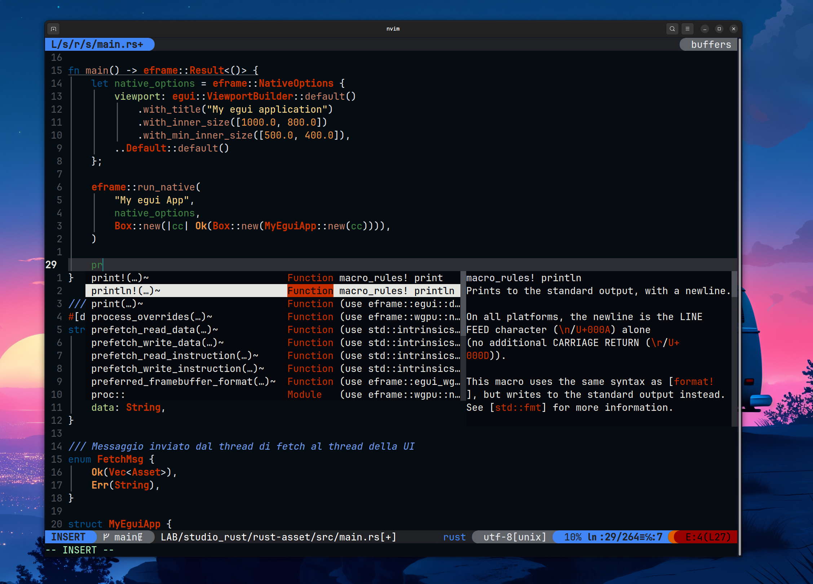
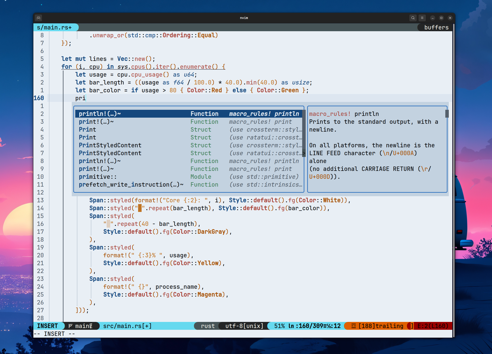

# mastyxtheme.nvim

Un colorscheme minimale e personalizzato per Neovim, scritto in Lua con supporto Treesitter.


normal version

light version

## Installazione

### [lazy.nvim](https://github.com/folke/lazy.nvim)

```lua
{
  "Mastyx/mastyxtheme.nvim",
  priority = 1000,
  config = function()
    vim.cmd.colorscheme("mastyxtheme")
  end,
}
```

### [packer.nvim](https://github.com/wbthomason/packer.nvim)

```lua
use({
  "Mastyx/mastyxtheme.nvim",
  config = function()
    vim.cmd.colorscheme("mastyxtheme")
  end,
})
```

### Manuale

```bash
git clone https://github.com/Mastyx/mastyxtheme.nvim ~/.config/nvim/pack/themes/start/mastyxtheme.nvim
```

Poi in Neovim:

```
:colorscheme mastyxtheme
```

## Varianti

Il tema è disponibile in due versioni:

- **`mastyxtheme`** — variante dark (default)
- **`mastyxtheme-light`** — variante light, sfondo chiaro azzurrino con testo in grassetto per maggior contrasto

Per usare la variante light:

```
:colorscheme mastyxtheme-light
```

## Struttura del progetto

```
mastyxtheme.nvim/
├── colors/
│ ├── mastyxtheme.lua -- entry point per :colorscheme mastyxtheme
│ └── mastyxtheme-light.lua -- entry point per :colorscheme mastyxtheme-light
├── lua/
│ └── mastyxtheme/
│ ├── init.lua -- logica di setup e highlight groups (dark)
│ ├── light.lua -- logica di setup e highlight groups (light)
│ ├── palette.lua -- definizione dei colori (dark)
│ └── palette_light.lua -- definizione dei colori (light)
├── README.md
└── LICENSE
```

## Requisiti

- Neovim >= 0.8
- Terminale con supporto true color (`termguicolors`)
- [nvim-treesitter](https://github.com/nvim-treesitter/nvim-treesitter) per l'highlighting completo

## Palette

### Dark (`mastyxtheme`)

| Colore       | Hex       |
| ------------ | --------- |
| Background   | `#050D12` |
| Foreground   | `#e5e6e1` |
| Blue         | `#2f7fd4` |
| Light Blue   | `#6f9af2` |
| Orange       | `#ee9245` |
| Light Orange | `#ffda8b` |
| Red          | `#c72f00` |
| Light Red    | `#c58067` |
| Green        | `#408243` |
| Light Green  | `#b7d288` |
| Yellow       | `#cfbb67` |
| Light Yellow | `#eee6c9` |

### Light (`mastyxtheme-light`)

| Colore       | Hex       |
| ------------ | --------- |
| Background   | `#e9eff5` |
| Foreground   | `#05070a` |
| Blue         | `#14477d` |
| Light Blue   | `#2c62b3` |
| Orange       | `#a8540a` |
| Light Orange | `#c07322` |
| Red          | `#8f1e18` |
| Light Red    | `#a8453b` |
| Green        | `#256640` |
| Light Green  | `#3e7d57` |
| Yellow       | `#7d620f` |
| Light Yellow | `#967d2e` |

## Licenza

[MIT](./LICENSE)
